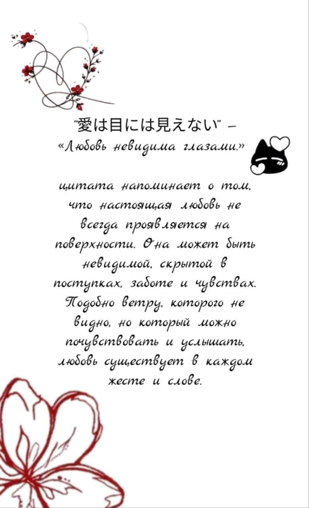
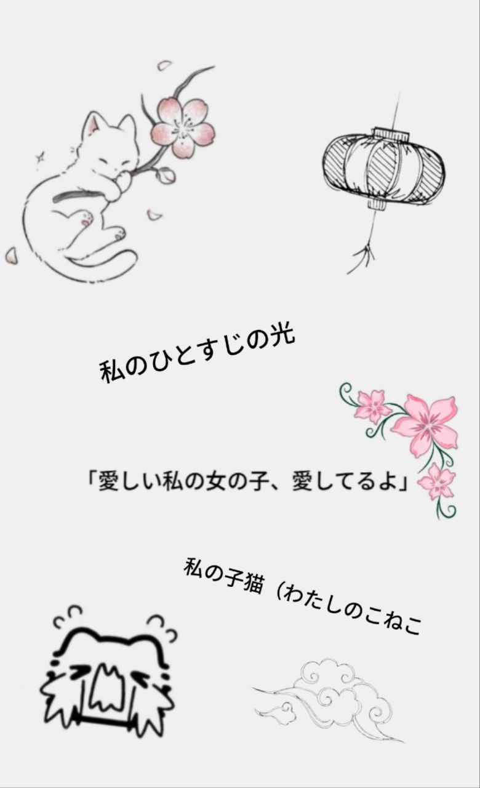

<!DOCTYPE html>
<html lang="ru">
<head>
<meta charset="UTF-8">
<title>Love Site</title>

</head>

<body>

<!-- LOGIN -->

    <input id="pass" type="password" placeholder="password">
    <button onclick="check()">Открыть</button>

<canvas id="fx"></canvas>

<!-- BOOK -->

    

        

            

            

                
                
            

        

    

</body>
</html>
